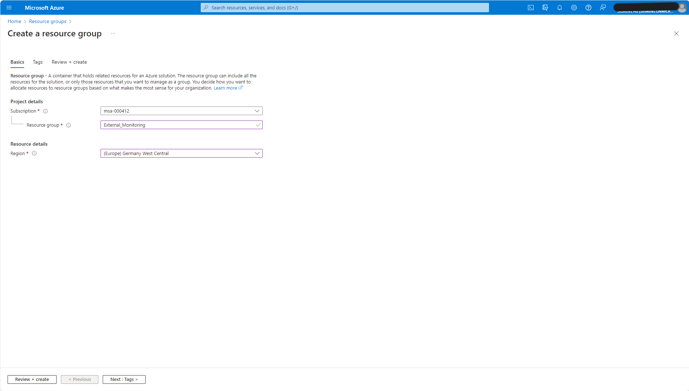

# Documentation - External Monitoring

In this documentation you learn how to set up an external monitoring on Microsoft Azure Container Instances with the help of the three containers: InfluxDB, Telegraf and Traefik . InfluxDB is an open-source time series database, that we use to display data gathered by Telegraf, an open-source plugin-driven server agent for collecting and reporting metrices from databases and systems. Additionally, we use Traefik as HTTP reverse proxy and load balancer, which automatically issues and synchronizes Let's Encrypt certificates.

At first, we make sure that we set up the right environment in Microsoft Azure. Next, we consider how to deploy a container group and what the used JSONC file used should to look like. Finally, we take a closer look at Traefik’s configuration files.

## Create environment in Microsoft Azure

To create a new Resource group in Microsoft Azure Resource groups, navigate on Microsoft Azure to “Resource groups” and click on the button “create”.

Choose a name for the new resource group, here we named it: “External_Monitoring”.  We also have to select a region, in which the resource group is created, in this case “(Europe) Germany West Central”. Then click on “Review + create”.

Next, we create a storage account, in which we want to generate some file shares. Later we are going to save the configuration files of the containers in these file shares. Now, click on “Create resources” to get to the Marketplace and search for “Storage account”.

In order to create a new storage account, proceed as follows: 

- Select the new created resource group “External_Monitoring”.
- Choose a unique name, in this case the new storage account is named “sdoexternalmonitoring”.
- It is also necessary to determine a Region, where the server is located. Here we choose “(Europe) Germany West Central”.
- As performance we select “Standard”.
- And we take the lowest redundancy category: “Locally-redundant storage (LRS)”.

Review and create the storage account.

After your deployment is complete, press “Go to resource” and select “File shares” to create a new file share.

    
    
    

Choose a name for the new file share and select a resource group. Click the button “Review + create” and after passed validation the new file share is created. We first create the file share “influxdbfileshare”, where the files for the InfluxDB container are stored. For that open the file share and upload the files: “influxd.bolt” and “influx.sqlite”. You find these files in the file directory on your computer in the folder “InfluxData”.

Then add two more file shares in the same way. One is for the configuration of the container for Telegraf: “telegraffileshare”. Upload here the Telegraf configuration file “telegraf.conf”.

For Traefik create the file share “traefikfileshare” and upload the static Traefik configuration “traefik.yaml”. For the dynamic configuration select “add directory” to create a subfolder in the traefikfileshare. Upload here the dynamic configration file “traefik-dynamic.yaml”.

The last file share we need for the container Traefik, is the file share “letsencryptfilesshare”, where the certificate will be stored.

## Deploy the container group

All required file shares have now been created, therefore we continue by the depoyment of the container group.  To deploy a container group on Microsoft Azure Container Instances we use a JSONC file. In this file the containers, volume mounts and exposed ports of the container group are defined:

At first we initialize the container group. The first container is the InfluxDB container with the latest InfluxDB image and the port 8086. As environment variables we save data for InfluxDB, among other things username and password for the login at InfluxDB. Furthermore the volume mount “influxdb-file” with the associated mount path is created.

The next conatiner is for Traefik. Here three ports are needed: 8080 (for the Traefik api), 80 (http) and 443 (https).  This time there are two volume mounts with two mount paths, one for Let’s Encrypt and the other one for the configurations of Traefik. 

The last container of the group is Telegraf. It needs three environment variables: the name of the organization in InfluxDB, the name of the bucket and the admin token. Additionally, for the configuration file of Telegraf a volume mount is needed.

Next, the volumes are defined. For every volume the name of the volume mount, the file share, the storage account, and the storage account key are needed.

At last, the exposed ports are listed, and we name the dns label. The section “diagnostics” generates the logs.
By running the PowerShell command

    New-AzResourceGroupDeployment -ResourceGroupName "External_Monitoring" -TemplateFile ".\tti.jsonc"

the JSONC file “tti.jsonc” is executed and the container group is deployed.

## The Traefik configuration files

In this section we look at the configurations of Traefik.

### The static configuration

There are two configuration files: the static configuration and the dynamic configuration. In the static configuration the network entry points into Traefik are defined. The first entry point is port 80, here we have a redirection to port 443, the second entry point.

The next paragraph is responsible for integrating the dynamic configuration . “directory” gives the file path to the dynamic configuration and “watch: true” allows Traefik to automatically watch for file changes. “certificatesResolvers” defines the certificate resolver, which is responsible for retrieving certificates from Let's Encrypt.

We enable the tlsChallenge and the httpChallenge.

In the static configuration we could also enable the logs, the api and the dashboard.

### The dynamic configuration

Finally, we consider the dynamic configuration:

We define a router “influxdb-ssl-router” with the entry point port 443, rule "host(\`*insert your url here*\`)" and the service "influxdb-service", which is defined below.
Now everything is set up so that the external monitoring should work.
